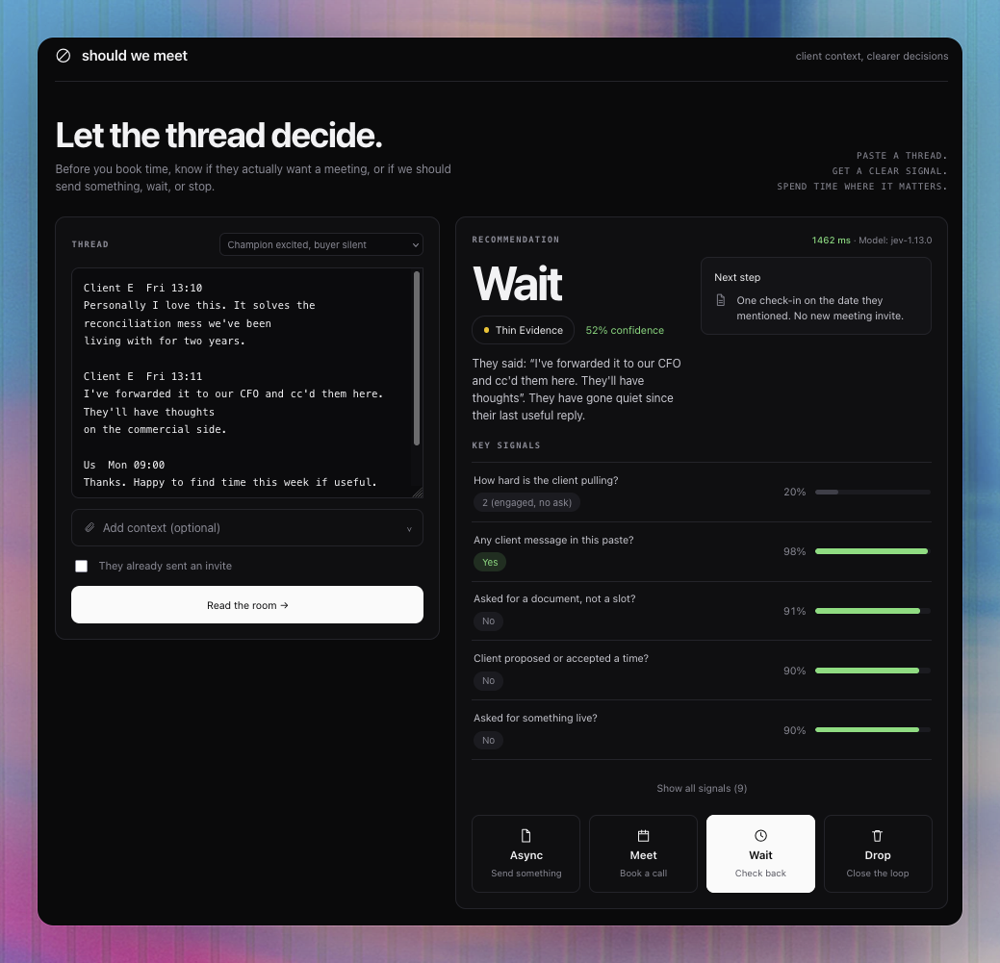

# Should We Meet?

A client interest gate. Paste a thread, get one call (**Meet**, **Async**, **Wait**, or **Drop**)
with the evidence behind it and a single next step.

> A meeting is earned by client pull, not by our enthusiasm.



*An excited champion, a cc'd CFO who never replied, and our own offer of time. Enthusiasm is
not pull, so the call is Wait on thin evidence, at 52% confidence.*

## Why this exists

We treat "a meeting" as the default next step. Clients often do not. They ask for a deck,
stall, loop in someone who never replies, or stay polite while they are not buying. The miss
is not calendar hygiene; it is reading **client pull** wrong.

| Decision | Meaning | Default next step |
|---|---|---|
| **Meet** | Client is pulling for time, people, or a decision | Book / accept |
| **Async** | Client is interested in information, not a slot | Send a note, deck, or recording |
| **Wait** | Interest existed or might return; they are not pulling now | One nudge, no hold on the calendar |
| **Drop** | No real interest, or interest that has ended | Stop proposing meetings |

## How it works

The engine is [Jev](https://docs.typesafe.ai), TypeSafe AI's System One model. Jev does not
generate text. It returns typed answers with probability distributions, every question
evaluated in parallel in one pass. That single fact shapes the whole design.

**One request per read**, carrying eleven questions:

- a **Choice** over `meet / async / wait / drop`: proposes the call, and gives a confidence
- a **Score**: how hard the client is pulling, on a four-level rubric
- eight **Nouls**, the evidence: did they propose a time, bring a decider, ask for a document,
  go quiet, close the door
- a **Choice over numbered thread lines**: picks the one line worth quoting back

Because Jev writes no prose, **the rationale is templated from the evidence**, not authored by
a model. Nothing in the explanation is generated: every clause traces to a signal that fired
and to a line the client actually wrote.

### The rules are code, not prompt

The model proposes; `verdict()` in [`server/utils/decide.ts`](server/utils/decide.ts) decides.
Every rule there is **downgrade-only**: a guardrail can move the call toward caution, but
nothing can promote a thread to Meet.

```
no client message in the paste     → cap at Wait      never Meet on our own outreach
the door is closed                 → Drop
no time, no attendee, nothing live → cap at Async     Meet is earned by pull
they asked for a document          → cap at Async     a document is not a meeting
they have gone quiet               → cap at Wait      silence is not interest
confidence below 0.5               → one step down    when unsure, do not book
an invite is already on the calendar → no effect      the call may contradict the calendar
```

A signal has to clear **0.7** to be stated as fact in the rationale, though the table shows
every signal at its true certainty. A near coin-flip is evidence, not a claim.

Confidence is reported in human words rather than a number alone: **clear**, **leaning**, or
**thin evidence**. A paste with no client message in it is always thin evidence, whatever the
model's own confidence says, and the rationale names what is missing.

## Quick start

```sh
bun install                       # or npm install
echo 'NUXT_TYPESAFE_API_KEY=...' > .env   # a key from console.typesafe.ai
bun run dev
```

The key stays server-side via `runtimeConfig` and never reaches the browser.

Pick anything from the **Load a sample…** dropdown to try it without writing a thread:
ten anonymised fixtures, one per row of the edge-case table.

## Tests

```sh
npm test       # node --test, 18 asserts, no network, no framework
npm run bench  # every sample thread against a running dev server, live
```

`npm test` checks the rules. It stubs Jev's answers, so it cannot tell you whether a rubric
still reads a thread correctly. `npm run bench` does that: it runs all ten samples against a
dev server and prints the call, the latency, and the signals worth watching, exiting non-zero
if any sample lands on an unexpected call. Run it after touching any rubric.

The spec's edge-case table *is* the suite. Each test stubs Jev's answers and asserts the
call `verdict()` makes, so the rules are checked without spending a request:

| Situation | Expected |
|---|---|
| Only our outbound, no client reply | Wait or Drop, never Meet |
| Client asked for pricing only | Async |
| Client offered two time slots | Meet |
| "Let's regroup next quarter" | Wait, if a date exists |
| Champion loves us, buyer is silent | Async or Wait |
| Procurement panel, "present to the board" | Meet |
| "Looks great!" and nothing else | Async |
| "Please stop emailing" | Drop |

## Overrides

The four buttons under the result are the override control, not an escape hatch. Pick another
label, write one line saying why, and it is saved against that thread in `localStorage` and
appended to the rationale. *"They are quiet but the RFP deadline is Friday, so Meet."*

## Layout

```
app/app.vue                  the one screen
app/samples.ts               ten sample threads
server/api/decide.post.ts    validate, number the lines, call Jev, apply the rules
server/utils/decide.ts       the questions, and verdict(), the product
server/utils/decide.test.ts  the edge-case table
PLAN.md                      the build plan and what was deliberately skipped
```

## What this is not

Not a meeting-effectiveness coach, not lead scoring, not auto-send or auto-decline, not a CRM
of record, and not a judgment of whether *we* want the logo.

## Known limits

- **No history.** Overrides live in the browser, keyed by thread. Cross-account learning needs
  a database, which the first release deliberately skips.
- **`gone_quiet` is still soft on short threads**, landing around 55-70% on the correct side
  rather than decisively. It stays out of the rationale below 0.7, so it reads as evidence
  rather than as a claim. Real threads with real timestamps should firm it up.
- **Latency** shown in the header is time in the model. Expect ~700 ms warm, more on a cold start.
